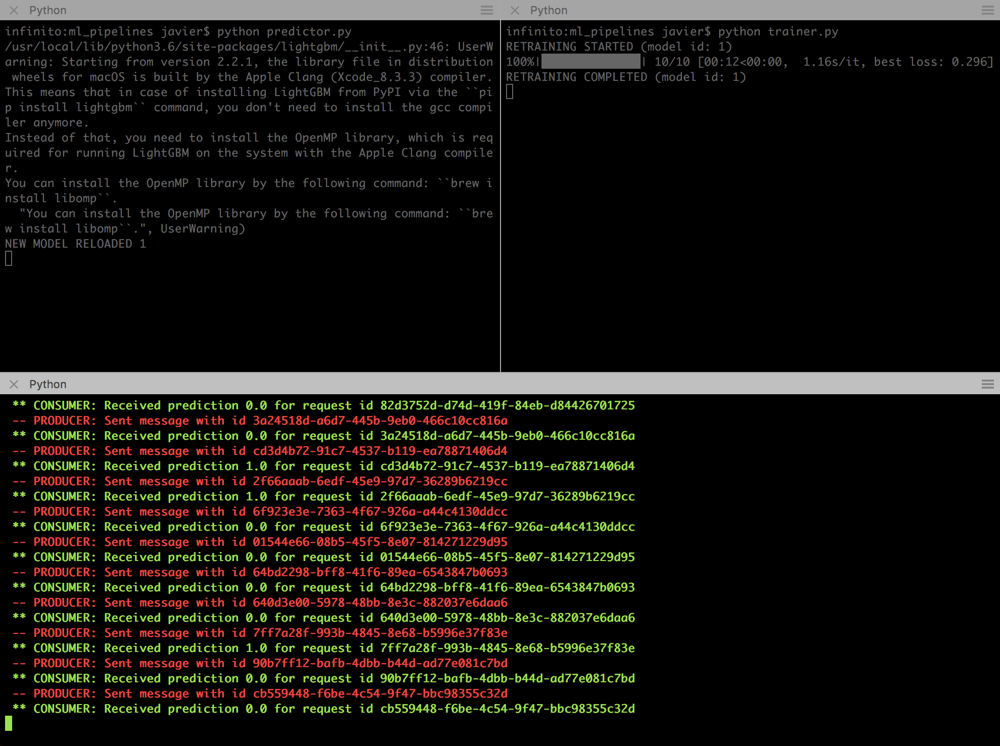

# Putting ML in Production
This repo contains code that we hope is useful to illustrate how one could productionise a real-time algorithm. The companion Medium post can be found here. The code here is meant to be as generic as possible (within certain limits), and is designed to be useful in an scenario similar to the following one.

## Scenario

A company collects data using a series of services that generate events as the users/customers interact with the the company's website or app. As these interactions happen, an algorithm needs to run in real time and some immediate action needs to be taken based on the algorithm's outputs (or predictions). On top of that, after N interactions (or observations) the algorithm needs to be retrained without stopping the prediction service.

For the exercise here we have used the [Adult](https://archive.ics.uci.edu/ml/datasets/adult) dataset, where the goal is to predict whether individuals earn an income higher/lower than 50k based on their age, native country, etc. To adapt this dataset to the scenario described before, one could assume that age, native country, etc is collected through an online questionnaire/form and we need to predict whether that individual is high/low income in real time. If high income, then we immediately call/email them with some offer, for example.

## Solution

The online part of our solution is illustrated in the figure below, and uses mainly [Kafka-Python](https://github.com/dpkp/kafka-python), [LightGBM](https://lightgbm.readthedocs.io/en/latest/#) and [Hyperopt](http://hyperopt.github.io/hyperopt/) or [HyperparameterHunter](https://github.com/HunterMcGushion/hyperparameter_hunter).


A full description of the solution can be found in the already mentioned Medium post. Briefly:

**OFFLINE TRAINING**

The offline process is fairly standard and all accomplished by running the `initialize.py` script. This script will download the dataset, set the dir structure, pre-preprocess the data, train an initial model on the training dataset and optimise the hyperparameters of that model. The results will be saved to disk and from there in advance we are ready to move to the online stage of the process.

**ONLINE PREDICTIONS AND RETRAINING**

 0. The App/Service (`app_sample.py`) will send messages (JSON) into the pipeline. These will be processed and App/Service will then get the results of the predictions.
 1. 1a) The messages from App/Service will be received by the Predictor (`predictor.py`)

 	1b) The Predictor will process the data and run the algorithm publishing the result, which will be eventually received by App/Service
 2. After N message the Predictor will publish a "retrain topic" message
 3. The Trainer (`trainer.py`) will receive the "retrain" message and start retraining the algorithm. In the meantime, the Predictor will not stop serving predictions.
 4. Once the algorithm is retrained, the Trainer will publish a message with the corresponding information (namely: *"retraining completed"*)
 5. The Predictor will receive the message that retraining is complete, it will load the new model and proceed as usual.

## How to run the pipeline

We first need to start Zookeeper and Kafka. Assuming these are installed using Homebrew, starting these services is as easy as:

```
$ brew services start zookeeper
==> Successfully started `zookeeper` (label: homebrew.mxcl.zookeeper)
$ brew services start kafka
==> Successfully started `kafka` (label: homebrew.mxcl.kafka)
```

As we mentioned before, the first script that needs to run is `initialize.py`. This can run "offline", meaning one could run this before starting Kafka. To train the algorithm and optimize the hyperparameters we have used LightGBM along with Hyperopt or HyperparameterHunter. The later is built on top of [Skopt](https://scikit-optimize.github.io/). It is not our goal here to compare hyperparameter optimization packages. Nonetheless, a brief comparison is included in the Medium post and a notebook comparing Skopt and Hyperopt performances is included here, in the notebooks directory.

After running `initialize.py` one simply needs to run `trainer.py`, `predictor.py` and `sample_app.py` as shown in the GIF below. Note that we have added a delay of 2 seconds between messages so the output in the screen is clearly readable.


After `RETRAIN_EVERY` messages (parameter to be set by the user), the user will be able to see how the algorithm is retrained in the terminal, as shown in the Figure below. The top-right terminal shows how Hyperopt has run 10 evaluations (in a real exercise these should be a few hundred). Once the model is retrained and optimised we see in the top-left window how the predictor has loaded the new model (after the annoying warning message from the new LightGBM version) and proceed with the prediction service as usual.




## Next Steps

In the following weeks/months we will include logging and monitoring using MLFLow as well flow management using Sagemaker.

For more detailed information please read the companion Medium post.